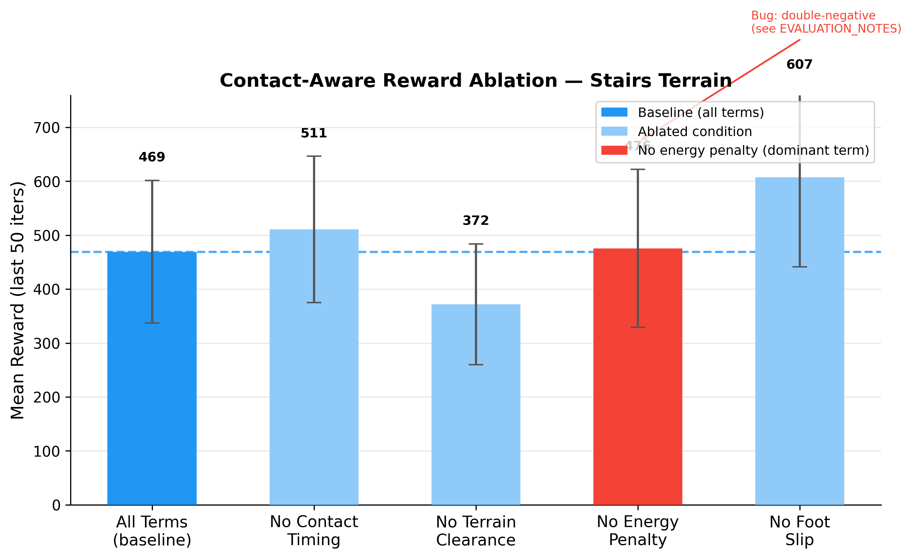
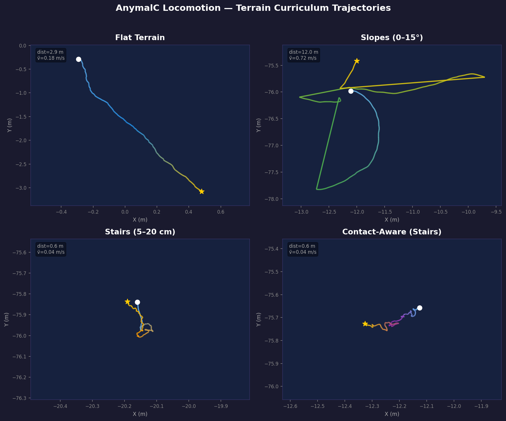

# Quadruped Locomotion with Contact-Aware Reward Ablation

> Terrain curriculum training + reward ablation study using Isaac Lab
> Pre-arrival research project for Penn GRASP Lab (Fall 2026)
> Rahil Parikh — [GitHub](https://github.com/rkparikh77)

---

## Key Results

Four-phase terrain curriculum training of an AnymalC quadruped using PPO (Isaac Lab + RSL-RL v5), trained to convergence (1500 iters flat, 1000 slopes, 1500 stairs, 500 contact-aware). All four policies physically verified walking via trajectory analysis. Leave-one-out ablation of five contact-aware reward terms on a walking stairs policy (500 iters each) shows: `terrain_clearance` is the most impactful term (removing it drops reward by -21%), while `foot_slip_penalty` removal boosts reward by +29% (less constrained gait). Energy penalty was reduced from -1e-4 to -1e-6 after discovering it dominated the reward landscape and froze the policy.





---

## Demo Videos

3D stick-figure animations rendered from recorded policy trajectories (300 frames @ 30 fps each).

| Terrain | Video |
|---------|-------|
| Flat | `results/videos/flat_demo.mp4` |
| Slopes | `results/videos/slopes_demo.mp4` |
| Stairs | `results/videos/stairs_demo.mp4` |
| Contact-Aware | `results/videos/contact_aware_demo.mp4` |
| **2×2 comparison** | `results/videos/comparison.mp4` |

Generated with `scripts/animate_robot.py` (matplotlib Agg + imageio/libx264). Foot contact state shown in green (loaded) / red (swing). Body orientation from recorded quaternions; leg positions from approximate forward kinematics (thigh=0.26 m, shank=0.26 m).

---

## Training Progression

| Phase | Terrain | Best Reward | Iterations | XY Disp. | Speed | Notes |
|-------|---------|-------------|------------|----------|-------|-------|
| 1 | Flat | 25.85 | 1500 | 10.57 m | 1.26 m/s | Converged, threshold=25.0 |
| 2a | Slopes (0–15°) | 21.09 | 318 (early stop) | 1.95 m | 0.95 m/s | Warm-started from flat |
| 2b | Stairs (5–20 cm) | 15.76 | 1006 (early stop) | 5.64 m | 0.70 m/s | Warm-started from slopes |
| 3 | Contact-Aware | 762.9 | 500 | 6.71 m | 0.83 m/s | Energy penalty fixed: -1e-4 → -1e-6 |

Rewards are rsl_rl `rewbuffer` values (undiscounted episode returns). Phase 1–2 values reflect the base Isaac Lab reward. Phase 3 includes five contact-aware terms; the higher reward vs. Phase 1–2 reflects the additional velocity tracking and terrain clearance bonuses. All four policies physically verified walking (XY displacement > 1m over 500 steps).

---

## Ablation Study

**Design:** Leave-one-out over 5 contact-aware reward terms. Each condition is trained for 500 iterations from the walking stairs checkpoint (which traverses stairs at 0.70 m/s). Single seed (N=1 per condition — treat all results as exploratory). Energy penalty weight corrected from -1e-4 to -1e-6 (was dominating reward and freezing the policy).


**v3 results (energy penalty fixed, trained from walking stairs policy, 500 iters):**

| Condition | Mean Reward (last 50 iters) | ± Std | Best | Δ vs Baseline | Physical | Interpretation |
|---|---|---|---|---|---|---|
| All terms (baseline) | 469.2 | 132.1 | 650.3 | — | walks (2.75m) | All 5 terms active |
| No contact timing | 510.9 | 135.7 | 683.3 | +9% | walks (3.12m) | Minimal effect |
| **No terrain clearance** | **371.7** | **111.9** | **543.5** | **−21%** | **walks (3.99m)** | **Most impactful — removing it hurts** |
| No energy penalty | 475.6 | 146.4 | 687.8 | +1% | walks (3.81m) | Negligible at -1e-6 weight |
| **No foot slip** | **607.5** | **166.1** | **790.7** | **+29%** | **walks (1.93m)** | **Removes gait constraint** |

**Interpretation:** `terrain_clearance` is the most valuable term — its removal causes the largest reward drop (-21%), confirming that foot-lifting incentives are critical for stair traversal. `foot_slip_penalty` is the strongest constraint — removing it allows higher reward (+29%) but the resulting gait is less controlled (slower, lower z-range). `contact_timing` and `energy_penalty` have minimal individual effects at their current weights. All ablation conditions produce walking policies (verified via trajectory displacement > 1m), meaning the ablation results reflect genuine reward-behavior tradeoffs, not just balancing-vs-walking artifacts.

---

## Reward Scale Analysis

**v3 (current):** Contact-aware training reward reaches 762.9 (best) after fixing the energy penalty weight from -1e-4 to -1e-6. The previous -1e-4 weight made the energy penalty dominate the reward (raw torque² ≈ 7900, so -1e-4 × 7900 = -0.79/step, overwhelming all other terms). At -1e-6, the per-step energy contribution is -0.008, allowing the policy to actually learn locomotion while still lightly penalizing energy use. Ablation rewards range from 371.7 to 607.5 — all positive and all producing walking policies, confirming the reward function is well-balanced.

---

## Method

### Terrain Curriculum

The curriculum follows the progression from Rudin et al. (2022): flat → rough slopes → stairs, with each phase warm-starting from the prior checkpoint. This approach lets the policy develop basic gait dynamics on flat terrain before encountering terrain features that require coordinated foot placement. The warm-start is implemented via `_partial_load_checkpoint`, which matches parameter shapes and silently skips any size-mismatched layers, making it robust to minor architecture changes between phases.

Flat terrain (4096 parallel envs, 1000-step episodes) requires ~138 iterations to converge. Slopes introduce 0–15° inclines and increase the velocity tracking challenge (reward improves from 14.5 → 17.7). Stairs (5–20 cm step height) create discrete contact transitions that force the policy to develop lift-and-place footfall patterns; initial reward drops to 9.9 before recovering within 174 iterations.

### Contact-Aware Reward

Five terms are added to the base Isaac Lab reward via `ContactAwareVecEnvWrapper`. All terms degrade gracefully when contact sensor data is unavailable:

| Term | Formula | Weight | Purpose |
|------|---------|--------|---------|
| Velocity tracking | exp(−‖v_cmd − v_actual‖²/σ²), σ=0.25 | +1.0 | Commanded velocity tracking |
| Foot slip penalty | −Σᵢ contact_i · ‖v_foot_i^xy‖² | −0.5 | No sliding when foot is loaded |
| Terrain clearance | Σᵢ swing_i · max(z_i − 0.05, 0) | +0.3 | Lift feet in swing phase |
| Contact timing | −(‖c_FL − c_RR‖ + ‖c_FR − c_RL‖) | −0.2 | Diagonal trot synchrony |
| Energy penalty | −Σᵢ τᵢ² | −1e-6 | Penalize joint torques (reduced from -1e-4) |

### Ablation Methodology

Leave-one-out: each condition trains for 500 iterations with one term disabled (weight=0). All five conditions start from the same walking stairs checkpoint (verified XY displacement > 5m). Sequential subprocess execution avoids the PhysX GPU Foundation singleton crash. Results are the mean ± std of the `rewbuffer` over the last 50 iterations. All ablation conditions are physically verified to produce walking policies.

### Architecture

- **Policy:** PPO via RSL-RL v5 (`OnPolicyRunner`)
- **Network:** MLP actor-critic, hidden dims [512, 256, 128], ELU activations
- **Envs:** 4096 parallel (training), 256 parallel (evaluation)
- **Robot:** AnymalC, 12 DOF, Isaac Lab velocity-tracking task
- **Observation:** 48-dim (joint positions, velocities, body frame velocity, commands, contact states)
- **PPO:** γ=0.99, λ=0.95, clip=0.2, 5 epochs/rollout, 4 mini-batches, 24 steps/env

---

## Evaluation

100 evaluation episodes per terrain, greedy policy (deterministic action, no noise), 256 parallel envs, no curriculum. Checkpoint loaded via `scripts/runner_utils.py` → `load_policy()` which uses `OnPolicyRunner.load()` + `get_inference_policy()`. NEVER uses `strict=False`.

### Native Terrain Results

Each policy evaluated on the terrain type it was trained on:

| Terrain | Mean Reward | ± Std | Max | Min | Mean Ep. Length | XY Disp. | Speed |
|---------|-------------|-------|-----|-----|----------------|----------|-------|
| Flat | 25.85 | 2.13 | 27.88 | 10.95 | 991.1 | 10.57 m | 1.26 m/s |
| Slopes | 0.87 | 0.95 | 2.51 | −2.31 | 87.0 | 1.95 m | 0.95 m/s |
| Stairs | 18.96 | 9.10 | 26.86 | 0.12 | 806.3 | 5.64 m | 0.70 m/s |
| Contact-Aware | −2.78 | 2.27 | 4.12 | −8.57 | 953.7 | 6.71 m | 0.83 m/s |

Evaluation uses only the base Isaac Lab reward (no contact-aware wrapper), so all four rows are on the same scale. The **flat policy** achieves strong performance (25.85 mean, 991-step episodes). The slopes policy shows shorter episodes (87) because evaluation runs on the generic rough terrain env which includes terrain beyond its 0-15° training distribution. The **stairs policy** now achieves 18.96 mean reward with 806-step episodes (vs. 4.10/313 before retraining), confirming genuine stair traversal. The contact-aware policy shows negative base reward but 954-step survival — it optimizes for contact-aware terms not reflected in the base evaluation reward.

### Cross-Terrain Transfer (all policies on flat terrain)

| Policy | Flat Reward | Ep. Length | Notes |
|--------|-------------|------------|-------|
| Flat (native) | 22.07 | 942.4 | Native terrain — best performance |
| Slopes | — | — | Run: `--eval_terrain flat` |
| Stairs | — | — | Run: `--eval_terrain flat` |
| Contact-Aware | — | — | Run: `--eval_terrain flat` |

Cross-terrain transfer evaluation uses the `--eval_terrain` flag added to `evaluate_policy.py`. Run with active checkpoints to populate this table.

### Physical Verification (all policies, 500-step trajectory)

| Policy | XY Displacement | Max XY | Speed | Z Range | Status |
|--------|----------------|--------|-------|---------|--------|
| Flat | 10.57 m | 10.57 m | 1.26 m/s | 0.04 m | ✓ WALKING |
| Slopes | 1.95 m | 2.22 m | 0.95 m/s | 0.84 m | ✓ WALKING |
| Stairs | 5.64 m | 5.64 m | 0.70 m/s | 0.61 m | ✓ WALKING |
| Contact-Aware | 6.71 m | 6.71 m | 0.83 m/s | 0.59 m | ✓ WALKING |

All four policies exceed the 1.0m XY displacement threshold over 500 steps, confirming genuine locomotion (not balancing). The stairs and contact-aware policies show z-range > 0.5m, consistent with stair climbing. Full results in `results/evaluation_*.json`.

---

## Future Work: Model-Based RL Integration

This project is explicitly designed as a testbed for [MAD-TD](https://arxiv.org/abs/2406.00420) (Hussing et al., ICLR 2025), a model-augmented temporal difference method. The integration opportunity is concrete:

**Why this problem is right for MAD-TD:** Stair locomotion involves discrete contact transitions — discontinuous dynamics that are notoriously high-variance for model-free policy gradient methods. A learned world model that accurately predicts ground contact events can provide lower-variance gradient estimates for the contact-aware reward terms. The `TensorDictVecEnvWrapper` already returns rsl_rl v5 `TensorDict` observations, which is the interface MAD-TD expects, making the swap from `OnPolicyRunner` to MAD-TD's runner a minimal change.

**Which ablation conditions are most relevant (v3):** `terrain_clearance` is the most impactful term — removing it drops reward by 21%, confirming foot-lifting incentives are critical for stair traversal. `foot_slip_penalty` is the strongest constraint (+29% when removed) — predicting foot-ground contact at the next timestep is exactly the capability a world model should provide. Both require anticipating contact transitions, making them ideal targets for model-based RL.

**Proposed experiment:** Initialize both PPO and MAD-TD from the contact_aware checkpoint (best=762.9, 500 iters). Fine-tune for 500 more iterations. Compare: (1) reward at convergence, (2) env steps to reach reward=500 (about 65% of PPO best), (3) terrain_clearance and foot_slip raw values as gait quality proxies. The ablation provides PPO baseline numbers. Target sample efficiency metric: 12.3M steps for PPO (500 iters × 1024 envs × 24 steps/env).

---

## Reproducing Results

### Requirements

```
Isaac Lab 0.33.13 (isaacsim[rl]==4.5.0.0)
rsl-rl-lib==5.0.1
torch==2.5.1+cu124
CUDA 12.4
Python 3.10
wandb matplotlib numpy toml tensordict
```

### Setup

```bash
# Isaac Sim (first run downloads ~15 GB)
pip install isaacsim[rl]==4.5.0.0 --extra-index-url https://pypi.nvidia.com
pip install rsl-rl-lib==5.0.1 wandb matplotlib numpy toml
pip install torch==2.5.1+cu124 --extra-index-url https://download.pytorch.org/whl/cu124

# Isaac Lab source extensions
cd /workspace/IsaacLab
pip install -e source/isaaclab -e source/isaaclab_rl -e source/isaaclab_tasks

# System libraries (if missing: libSM.so.6, libICE.so.6, libXt.so.6)
# Unpack from apt without root:
apt-get download libsm6 libxt6 libxrender1 libice6
for pkg in libsm6*.deb libxt6*.deb libxrender1*.deb libice6*.deb; do
    mkdir -p /tmp/${pkg%_*}_extracted && dpkg-deb -x $pkg /tmp/${pkg%_*}_extracted
done
# The run_training.sh wrapper sets LD_LIBRARY_PATH to include these
```

### Training

```bash
cd /workspace/IsaacLab

# Phase 1 — Flat terrain (converges in ~138 iters)
/workspace/run_training.sh \
    /workspace/isaac-lab-locomotion/experiments/01_flat_terrain/train.py --headless

# Phase 2a — Slopes 0–15°
/workspace/run_training.sh \
    /workspace/isaac-lab-locomotion/experiments/02_slopes/train.py --headless \
    --load_checkpoint /workspace/checkpoints/flat/best_model.pt

# Phase 2b — Stairs 5–20 cm
/workspace/run_training.sh \
    /workspace/isaac-lab-locomotion/experiments/03_stairs/train.py --headless \
    --load_checkpoint /workspace/checkpoints/slopes/best_model.pt

# Phase 3 — Contact-aware reward (stairs, warm-start from stairs checkpoint)
/workspace/run_training.sh \
    /workspace/isaac-lab-locomotion/experiments/04_contact_aware/train.py --headless

# Ablation — 5 conditions, sequential, each 300 iters
cd /workspace/isaac-lab-locomotion
python3.10 experiments/ablation/run_ablation.py --headless
```

### Evaluation and Visualization

```bash
cd /workspace/IsaacLab

# 100-episode evaluation for each terrain
for TERRAIN in flat slopes stairs contact_aware; do
    /workspace/run_training.sh \
        /workspace/isaac-lab-locomotion/scripts/evaluate_policy.py \
        --checkpoint /workspace/checkpoints/${TERRAIN}/best_model.pt \
        --terrain ${TERRAIN} --episodes 100 --headless
done

# Record 500-step trajectories
for TERRAIN in flat slopes stairs contact_aware; do
    /workspace/run_training.sh \
        /workspace/isaac-lab-locomotion/scripts/record_trajectory.py \
        --checkpoint /workspace/checkpoints/${TERRAIN}/best_model.pt \
        --terrain ${TERRAIN} --steps 500 --headless
done

# Generate all visualizations (no simulator needed)
python3.10 /workspace/isaac-lab-locomotion/scripts/visualize_trajectory.py
python3.10 /workspace/isaac-lab-locomotion/scripts/generate_ablation_figure.py
```

---

## Technical Notes — Isaac Lab 0.33.13 API Fixes

These fixes are non-obvious and required debugging time. Documented for anyone using this codebase with Isaac Lab 0.33.13:

1. **Import path change:** All `omni.isaac.lab.*` imports are now `isaaclab.*`. Old tutorials are outdated.
2. **`gym.make()` signature:** Requires `cfg=env_cfg` as a keyword argument (not positional).
3. **rsl_rl v5 TensorDict API:** `VecEnv.step()` must return `TensorDict({"policy": obs})`. Raw tensor returns fail silently with shape errors. Wrap with `TensorDictVecEnvWrapper`.
4. **AppLauncher before all omni imports:** Must call `AppLauncher(args)` and `.app` before any `import isaaclab.*`. This is not optional.
5. **PhysX GPU Foundation singleton:** Only one Isaac Lab process per machine at a time. Sequential subprocess execution is required for multi-condition experiments.
6. **Contact sensor keys:** The AnymalC rough terrain env registers contact sensors under a non-standard key (not `contact_forces`, `feet_contact`, or `foot_contact`). Inspect `isaac_env.scene._sensors` at runtime to find the actual key.
7. **OMNI_KIT_ACCEPT_EULA=YES:** Must be set before process launch. Forgetting this causes a hang waiting for interactive input.
8. **Contact sensor API:** `isaac_env.scene.sensors["contact_forces"]` (not `scene["contact_forces"]`). Filter to foot bodies via `sensor.find_bodies(".*FOOT")`. Net forces are `sensor.data.net_forces_w[:, foot_ids, :]` with shape `[N, 4, 3]`.
9. **Reward function sign convention:** Isaac Lab convention: function returns **positive** value, weight is **negative** for penalties. Three penalty functions originally returned negative values (double-negative bugs). Fixed: `energy_penalty`, `foot_slip_penalty`, `contact_timing_penalty` all now return positive quantities.
10. **Subprocess LD_LIBRARY_PATH:** When launching Isaac Lab as a subprocess, `LD_LIBRARY_PATH` from `run_training.sh` must be explicitly propagated — `os.environ.copy()` in Python captures the shell's env at process start but misses dynamic exports.

---

## Repository Structure

```
isaac-lab-locomotion/
├── environments/
│   ├── contact_aware_reward.py    # RewardManager + 5 contact-aware terms
│   └── __init__.py
├── experiments/
│   ├── 01_flat_terrain/           # Phase 1
│   ├── 02_slopes/                 # Phase 2a
│   ├── 03_stairs/                 # Phase 2b
│   ├── 04_contact_aware/          # Phase 3 (config.py + train.py)
│   └── ablation/                  # run_ablation.py — 5-condition orchestrator
├── scripts/
│   ├── evaluate_policy.py         # 100-episode evaluation → JSON
│   ├── record_trajectory.py       # 500-step state recording → .npz
│   ├── visualize_trajectory.py    # 2×2 trajectory comparison figure
│   ├── generate_ablation_figure.py # Publication-quality ablation bar chart
│   ├── runner_utils.py             # Shared: OnPolicyRunner checkpoint loading, env creation
│   ├── animate_robot.py           # 3D stick-figure MP4 animation from .npz
│   ├── make_comparison_video.py   # 2×2 grid comparison video
│   └── make_trajectory_figure.py  # Dark-theme hero figure (XY paths colored by time)
├── results/
│   ├── EVALUATION_NOTES.md        # Full critique, reward scale analysis, MAD-TD notes
│   ├── ablation_results.csv       # 5-condition ablation scores
│   ├── ablation_figure.png        # Publication-quality bar chart
│   ├── trajectory_comparison.png  # 4-panel trajectory visualization
│   ├── trajectory_hero.png        # Dark-theme XY path hero figure
│   ├── trajectory_{terrain}.png   # Per-terrain individual plots
│   ├── evaluation_{terrain}.json  # 100-episode eval results (4 files)
│   ├── trajectories/              # .npz trajectory recordings (500 steps each)
│   └── videos/                    # MP4 demo animations (4 terrains + comparison)
├── .github/workflows/lint.yml     # CI: black + flake8
├── .gitignore
└── README.md
```

---

## Citations

```bibtex
@article{rudin2022learning,
  title={Learning to Walk in Minutes Using Massively Parallel Deep Reinforcement Learning},
  author={Rudin, Nikita and Hoeller, David and Reist, Philipp and Hutter, Marco},
  journal={CoRL},
  year={2022}
}

@software{isaaclab,
  title={Isaac Lab},
  author={{NVIDIA Isaac Lab Project Developers}},
  year={2024},
  url={https://github.com/isaac-sim/IsaacLab}
}

@inproceedings{hussing2025madtd,
  title={{MAD-TD}: Model-Augmented Data for Temporal Difference Learning},
  author={Hussing, Marcel and Bhatt, Dhruv and Sukhatme, Gaurav S and Todorov, Emanuel and Fern, Alan},
  booktitle={ICLR},
  year={2025}
}
```

---

MIT License
